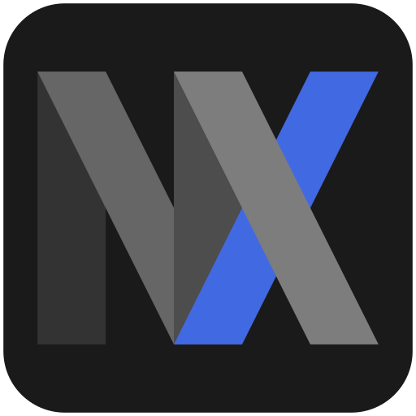

<!-- header -->
<div>
  
  <h3><strong>MXIV</strong>
  </h3><p>Media Explorer & Interactive Viewer</p>
</div>

![cover]

## Overview

MXIV is a keyboard-oriented media viewer intended to navigate heterogeneous galleries, displaying images & videos interchangeably. For interactivity, all actions can be discovered, ran and accelerated from the action palette.

## Features

- **Explorer** - Navigate through files & folders without leaving the window
- **Multimedia** - Display a large range of formats such as PNG, GIF, WEBP, WEBM, MP3, MP4...
- **Interactive** - Fit display to width, height, set zoom, loop videos, play slideshows...
- **Searchable** - Open multiple folders as one, find or filter files through actions
- **Tabs** - Create, switch or duplicate tabs. Then save, restore or delete session profiles
- **Tags** - Simple but extendable JSON tag database for file tracking
- **Library** - Gather folders & archives for tagging, search and quick access
- **Asynchronous** - No frozen GUI while opening a mounted HDD or remote directory
- **Configurable** - Accelerate any action with hotkeys, run your own scripts on a file
- **Keyboard Centric** - Favor keyboard commands & shortcuts over buttons & menus ( *it's a feature, I swear* )

## Runtime Dependencies

- [**Electron**][1] - Application framework
- [**7z**][2] _(provided by [**p7zip**][3] on Linux)_ - To temporarily extract and view archived media files
- [**ImageMagick**][4] - To generate thumbnails for media folders & archives in library
- [**Font Awesome**][5] - Icon Fonts **( included )** 

## Usage

With [**Electron**][1] already installed:

```bash
# simple shortcut
electron "path/to/src"
```

Otherwise, see how to [setup the repo, run or build MXIV packages](#repository-setup).

<!-- Not serving releases yet :P
Loosely packaged binaries are available in the [**Releases**](releases) section.

---

However, if you **already** have [**Electron**][1] installed **or want to package MXIV yourself**, just download the source archive and create a **shortcut** pointing electron to where you extracted it:
```bash
# mxiv shortcut file
electron "<path to your extracted mxiv archive>" 
```
 -->
> Regardless of method, make sure [7z][2] and [convert][4] binaries are **available from your [PATH][6]** to use their features, as they're not redistributed within the packages.

## Repository Setup

```bash
# clone repository into a new "mxiv" folder
git clone "https://github.com/rvcalisto/mxiv.git" "mxiv"

# fetch and install electron, electron-forge
cd mxiv; npm install

# run mxiv
npm start

# build platform specific packages
npm run make
```

<!-- links -->
[1]: https://www.electronjs.org
[2]: https://www.7-zip.org
[3]: https://github.com/p7zip-project/p7zip
[4]: https://imagemagick.org
[5]: https://fontawesome.com
[6]: https://en.wikipedia.org/wiki/PATH_(variable)
[icon]: ./src/icons/mxiv.png
[cover]: ./cover.png
